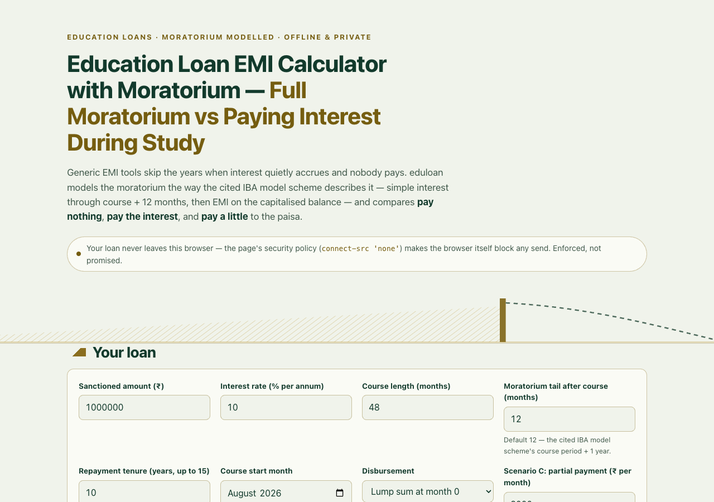

# eduloan

**The education-loan EMI calculator that models the moratorium** — pay nothing, pay
interest, or pay a little during study, compared to the paisa, entirely on your device.

**Live:** https://sreenivas-sadhu-prabhakara.github.io/eduloan/



## Why

Generic EMI calculators skip the moratorium entirely — the course years plus the
12-month tail when simple interest quietly accrues and nobody pays. Under the IBA
Model Education Loan Scheme that accrued interest is added to your principal and the
EMI is set on the total, so the choice you make during study — nothing, interest, or
a little — routinely moves the total outflow by **lakhs**. eduloan makes that choice
visible and exact.

## Features

- **Moratorium engine** — simple interest accrues per disbursed tranche through
  course + 12 months (the cited IBA model scheme treatment), then the closed-form
  annuity EMI on the capitalised balance. A labelled *"my bank compounds monthly"*
  toggle switches the accrual model.
- **The three-scenario comparison** — A: full moratorium · B: interest served
  monthly · C: partial ₹X/month — side by side with balance at EMI start, EMI, total
  interest, total outflow, and a *"paying ₹X during study saves ₹Y over the loan"*
  delta, all computed in integer paise.
- **The moratorium wedge** — an inline-SVG timeline of the three balance paths; the
  hatched gold wedge is the interest accruing while nobody pays.
- **Month-by-month schedules** — moratorium accrual rows, then amortization rows
  grouped by year, closing at exactly ₹0.00, with per-financial-year (April–March)
  interest subtotals.
- **Section 80E card** — the verbatim statute plus your per-FY interest-paid figures
  (the number an 80E claim is based on). No tax-saved rupee number, ever.
- **CSIS check** — the cited eligibility checklist; a self-declaration only annotates
  Scenario A ("borne by GoI if approved — confirm with your bank") and never changes
  the math.
- **Loan setup** — sanctioned amount, rate, course length, editable moratorium tail,
  tenure up to 15 years, lump-sum or equal yearly/semester tranches, ₹ lakh/crore or
  plain grouping, instant recompute.
- **Named scenarios** saved to localStorage, a one-page **print comparison sheet**
  (print-to-PDF is the PDF path), and **RFC-4180 CSV** export of any schedule.
- **Rules panel** — all 14 corpus facts with clause citation, source and verified-on
  date. Nothing invented.

## Quickstart

It's a static page — open `index.html` in any modern browser, or serve the folder:

```sh
python3 -m http.server 8080   # then http://localhost:8080/
```

No build step, no dependencies. Run the self-tests (Node 20+):

```sh
node --test
```

The suite re-derives the annuity formula, asserts the worked-loan fixtures to the
paisa (EMI 13215.07 / 19822.61 / 17443.90 / 17840.35; outflows 2378713.27 /
2085809.12 / 2273267.48 and both deltas exactly), checks schedule integrity and FY
bucketing, fuzzes 3000 seeded loans for `Σ principal === balance` in integer paise,
and gates the corpus (14 facts, provenance complete, mandated verbatim quotes present).

## Privacy — enforced, not promised

The page ships `Content-Security-Policy: default-src 'self'; connect-src 'none'`:
the **browser itself** blocks every network request, so your loan figures cannot
leave the page. No accounts, no analytics, no cookies, no CDN, no service worker.
Saved scenarios live only in your browser's localStorage — clearing site data erases
them; print/CSV export is the only backup.

## Honest limits

- Moratorium interest follows the cited IBA model scheme (simple interest); banks may
  compound monthly or set their own rules. The toggle covers the two common
  treatments — figures may still differ from your bank's statement.
- The rate is held constant for the whole tenor; education loans are floating and
  repo resets will move real figures.
- Disbursement is modelled as a lump sum or equal tranches on month boundaries; real
  tranches follow fee-demand letters, so accrued interest is an estimate.
- The 80E card shows the verbatim statute and your interest-paid figures only —
  conditions apply, and it is not tax advice.
- CSIS eligibility is decided by the bank and the Ministry of Education, not this
  tool; scheme figures were verified on 2026-07-23 and may be amended.
- IBA's own scheme PDF was unreachable at build; the scheme clauses were verified
  across two member-bank implementations plus a secondary summary (see
  `sources/CITATIONS.md`). incometaxindia.gov.in blocked automated access, so the
  Section 80E text was verified on Indian Kanoon's reproduction of the Act.

## Disclaimer

eduloan is an informational calculator, **not financial, tax, or investment advice**.
The software is provided "as is", without warranty of any kind; the author accepts no
liability for decisions taken on its figures. Your bank's sanction letter, statements
and interest certificate govern. Verify every figure with your bank and a qualified
professional before acting.

## License

MIT © 2026 Sreenivas Sadhu Prabhakara — see [LICENSE](LICENSE).
